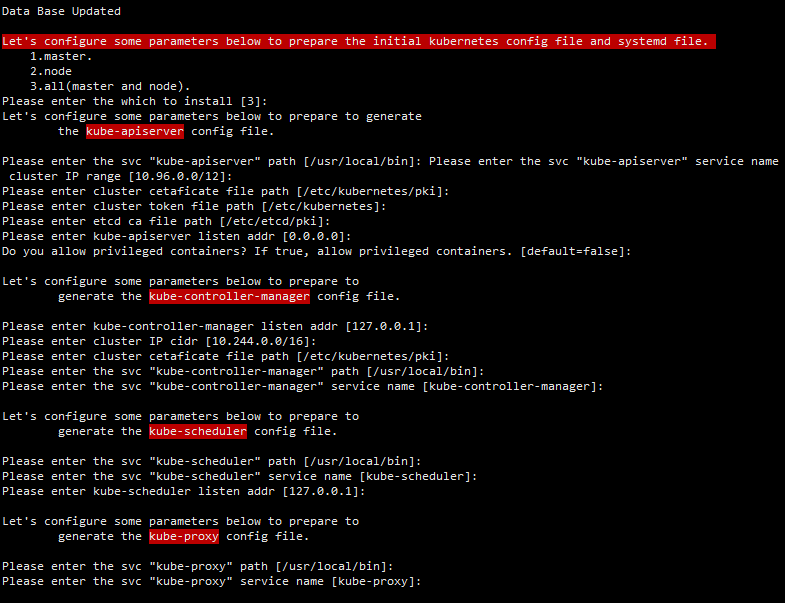

## kubernetes-certificates-generator

A simple script to generation of certificates, configuration files, systemd files, etc.  required for binary deployment of kubernetes clusters

### Quick Start

```
chmod +x generator
./generator
```


